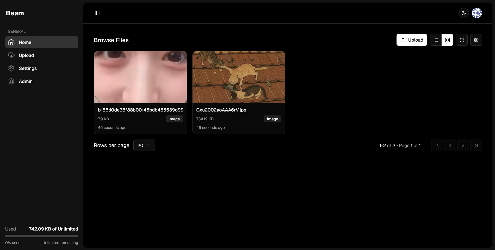
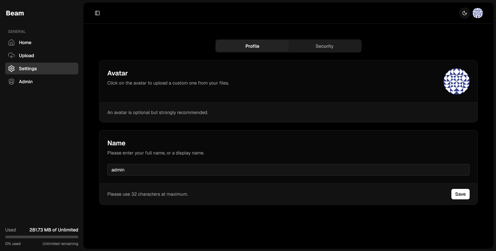

# Beamz

[Preview](#preview)

## Features

- ⚡ Blazing fast — optimized for low latency and high throughput.
- 🧩 Minimal resource usage — tiny Docker image (~249 MB) for economical deployments.
- 🔁 Chunked & resumable uploads — reliably upload large files and resume interrupted transfers.
- 📁 Flexible file management — browse, organize, delete, and preview uploads.
- 📦 Per-user quotas — enforce storage limits per user.
- 👥 User management — accounts, permissions, and simple administration.
- 📤 ShareX-compatible upload endpoint for easy client integration.
- 🖼️🎬🔊 Automatic thumbnails & previews for images, video, and audio files.
- 🚧 More features coming — actively developed with frequent improvements.

## Recommended (preferred) — Docker Compose

This is the simplest and recommended way to deploy locally or on a server that supports Docker.

1. Clone the repo and change into it:

   ```sh
   git clone https://github.com/renzynx/beamz
   ```

   ```sh
   cd beamz
   ```

2. Configure (optional):
   - The default `docker-compose.yml` uses the image `ghcr.io/renzynx/beamz`.
   - If you want to run the built image locally, build it then use the compose file or update the `image:` value.

3. Environment variables (set via compose file or environment):
   - `NODE_ENV=production`
   - `BASE_URL=https://example.com` — The URL you are deploying to
   - `SECRET=32-characters-random-string-for-secret`

4. Volumes (compose) mount:
   - `./uploads:/app/uploads` — persistent file uploads
   - `./data:/app/data` — sqlite DB files

5. Start the stack (detached):

   ```sh
   docker compose up -d
   ```

6. Check logs (optional):

   ```sh
   docker compose logs -f
   ```

Now your application should be running at http://localhost:3000

## Manual deployment (no Docker) — for advanced / debugging

This assumes you have `bun` installed and want to run the services directly on a linux host.

1. Install dependencies at repo root:

   ```sh
   bun install
   ```

2. Build packages:

   ```sh
   bun run build
   ```

   # copy web standalone assets

   ```sh
   cp -r public .next/standalone/packages/web/
   ```

   ```sh
   cp -r .next/static .next/standalone/packages/web/.next/static
   ```

3. Prepare runtime data and run migrations:

   ```sh
   bun db:migrate
   ```

4. Start services (backgrounding with & for linux shell; use a process manager in production):

   ```sh
   bun start
   ```

Important:

- Running multiple processes in one environment is fragile. Use systemd, supervisord, or container orchestration in production.
- The Docker image in this repo uses an Alpine-based Bun runtime.

## Building the production Docker image locally

1. Build the image (from repository root):

   ```sh
   docker build -t <your-namespace>/beamz .
   ```

2. Optionally push to a registry:

   ```sh
   docker tag <your-namespace>/beamz ghcr.io/<your-namespace>/beamz:latest
   ```

   ```sh
   docker push ghcr.io/<your-namespace>/beamz:latest
   ```

3. Update `docker-compose.yml` `image:` field to point to your image or run the compose file using the built local image.

## Troubleshooting

- Logs:
  - Use `docker compose logs -f` to stream logs for all services.

## Preview

<p align="center">
  
  
</p>

---
